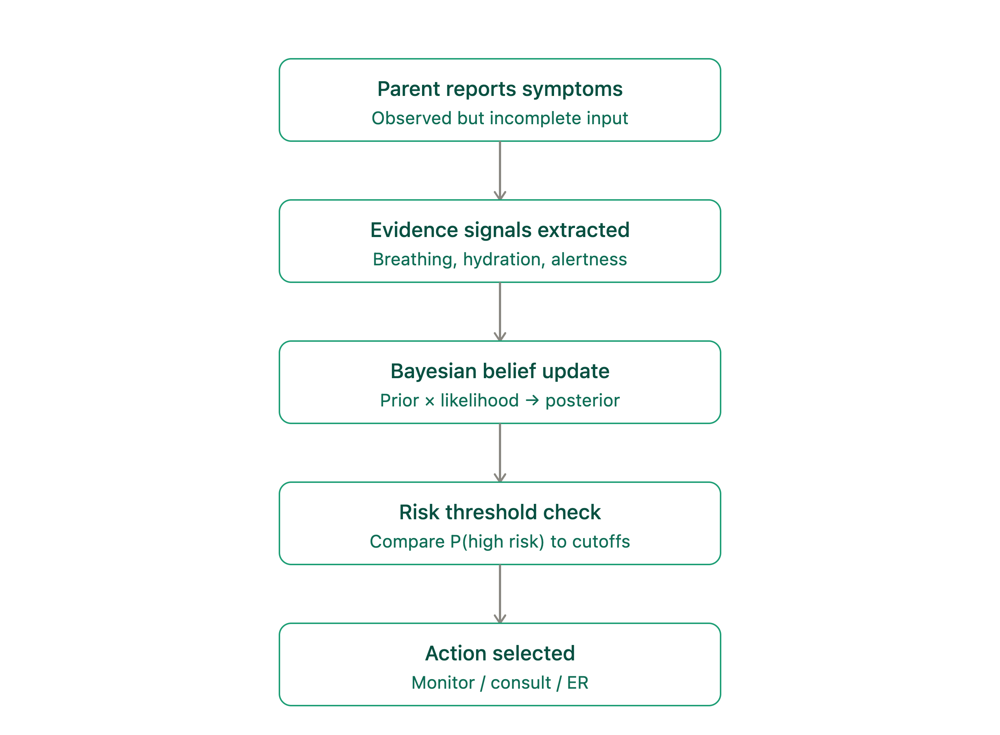
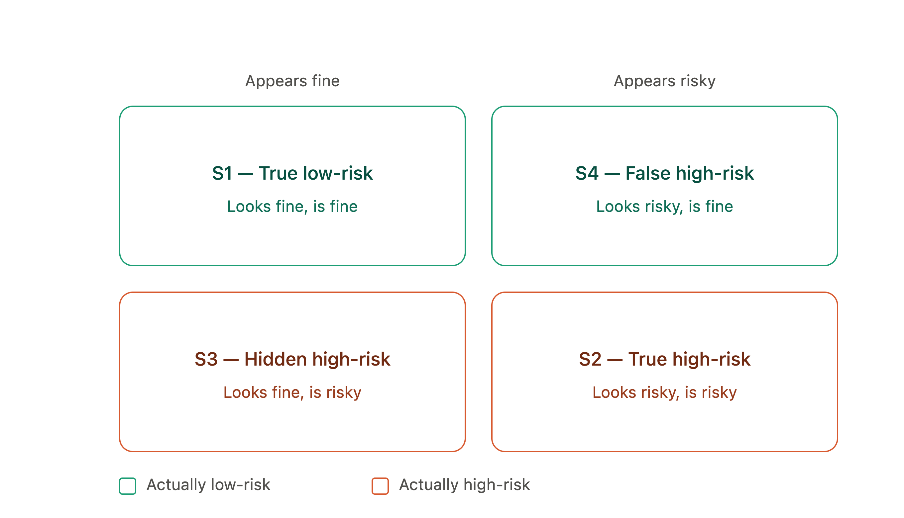
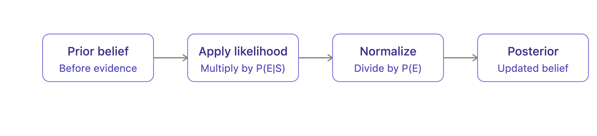

# Belief Table :

## State names:

* S1 = True Low-risk
* S2 = True High-risk
* S3 = Hidden High-risk
* S4 = False High-risk

## Assigning Prior Probabilities (Before seeing evidences the follwing are what we believe how likely each state is)

* S1 = 0.60
* S2 = 0.20
* S3 = 0.10
* S4 = 0.10

S1+S2+S3+S4 = 1.00

## Defining the evidence

E = Mild symptoms + normal breathing + normal hydration + child alert.

This is the observed evidence.

## Assigning likelihoods (Asking if this state is true then how likely this particular evidence is supposed to occur)

* P(E | S1)= 0.80
* P(E | S2)= 0.20
* P(E | S3)= 0.40
* P(E | S4)= 0.30

## Calculating un-normalized posteriors : P(E | Si) X P(Si)
* S1 => 0.8*0.6 = 0.48
* S2 => 0.2*0.2 = 0.04
* S3 => 0.4*0.1 = 0.04
* S4 => 0.3*0.1 = 0.03

P(E) = 0.48 + 0.04 + 0.04 + 0.03 = 0.59

Given our four possible states and the priors/likelihoods we assigned, the overall probability of observing evidence E is 0.59.

## Calculating posterior probabilities for each state 

P(Si | E) = (P(E | Si)*P(Si))/P(E)

So after observing evidences we get the following updated beliefs:

* S1 = 0.8136 => 81.36%
* S2 = 0.0678 => 6.78%
* S3 = 0.0678 => 6.78%
* S4 = 0.0508 => 5.08%

0.8136 + 0.0678 + 0.0678 + 0.0508 => 1.00 (Sum of Posterior belief should also add to 1)

| State | Prior | Posterior | Change |
|---|---:|---:|:---:|
| S1 — True Low-Risk | 0.60 | 0.8136 | ↑ |
| S2 — True High-Risk | 0.20 | 0.0678 | ↓ |
| S3 — Hidden High-Risk | 0.10 | 0.0678 | ↓ |
| S4 — False High-Risk | 0.10 | 0.0508 | ↓ |

## Action thresholds (based on updated probabilities of each state)

There is no universally validated probability threshold for pediatric medical decision-making. Real triage systems (as recommended by WHO) uses red / yellow / green acuity categories based on clinical signs (not Bayesian probability), with red requiring immediate care, yellow urgent care, and green non-urgent care. The thresholds are being adopted as illustrative thresholds for this simulation, inspired by the study (https://pmc.ncbi.nlm.nih.gov/articles/PMC9723221/):

| Risk Probability        | Action                                             |
|-------------------------|----------------------------------------------------|
| Low (<=8%)              | Monitor                                            |
| Medium (>8% and <=40%)  | Consult doctor (nurse line / pediatrician)         |
| High (>40%)             | Emergency evaluation                               |

Our calculations yielded the following results after update:

* P(Low Risk | E ) = P(S1) + P(S4) = 0.8136 + 0.0508 = 0.8644 (86.44%)

* P(High Risk | E )= P(S2) + P(S3) = 0.0678 + 0.0678 = 0.1356 (13.56%)

Although we have both the probabilities available but here for decision making we ar choosing the P(High Risk | E ) because the primary decision concern is the high risk underlying state. 

So now based on that we see that P(High Risk | E)= 13.56% and it falls under the Medium category so that agent would suggest the action as "Consult doctor".

Thus, in this simulated example, the reassuring evidence reduces the estimated high-risk probability from the prior level, but does not reduce it enough to cross the model's lowest-risk threshold.

## Test Cases (values and symptoms are simulated)

* TC1 is calculated in detail before this section. For rest of the Test Cases the necesaary final results have been displayed.

| TC# | Evidence | P(E\|S1) | P(E\|S2) | P(E\|S3) | P(E\|S4) | P(High Risk\|E) | Action |
|---:|---|---:|---:|---:|---:|---:|---|
| 1 | Mild symptoms, normal breathing/hydration, alert | 0.80 | 0.20 | 0.40 | 0.30 | 13.56% | Consult doctor |
| 2 | Lethargic, pink cap refill, mild tachypnea | 0.10 | 0.40 | 0.55 | 0.10 | 65.85% | Emergency evaluation |
| 3 | Normal behavior, pale/3–4s cap refill, normal respiration | 0.85 | 0.01 | 0.09 | 0.10 | 2.07% | Monitor |
| 4 | Irritable, pale/3–4s cap refill, mild tachypnea | 0.25 | 0.30 | 0.45 | 0.35 | 36.21% | Consult doctor |
| 5 | Sleepy but consolable, pink/normal, normal respiration | 0.70 | 0.05 | 0.15 | 0.20 | 5.38% | Monitor |
| 6 | Lethargic, gray/mottled >5s, severe tachypnea | 0.02 | 0.85 | 0.30 | 0.05 | 92.17% | Emergency evaluation |
| 7 | Playing normally, pink/normal, moderate tachypnea/retractions | 0.30 | 0.25 | 0.50 | 0.35 | 31.75% | Consult doctor |
| 8 | Irritable, gray/4–5s cap refill, moderate tachypnea/retractions | 0.05 | 0.55 | 0.40 | 0.15 | 76.92% | Emergency evaluation |
| 9 | Sleepy but consolable, pale/3–4s cap refill, mild tachypnea | 0.45 | 0.15 | 0.35 | 0.30 | 17.81% | Consult doctor |
| 10 | Lethargic, pink/normal cap refill, normal respiration | 0.08 | 0.25 | 0.50 | 0.15 | 61.35% | Emergency evaluation |

## Failures/Limitations

* Two actions got merged into one
I planned for 4 actions (monitor, nurse line, pediatrician, ER), but my threshold rule only has 3 bands. "Nurse line" and "pediatrician visit" both landed under "Consult doctor" because risk probability alone can't tell them apart and that would need something like how urgent not just how risky.

2. My numbers are for illustration and not real data
Every likelihood number in this file came from reasoning it out, not from actual pediatric cases. In Test Case 2, changing just one sign (lethargy) flipped the result from "consult a doctor" to "go to the ER." That shows how much a single guessed number can swing the outcome.

3. The trickiest state is also the most important one
S3 (Hidden High-risk) means "actually dangerous, but doesn't look dangerous yet." That's really hard to tell apart from S1 (actually fine) using symptoms alone and that is basically the whole real-world problem this project is trying to help with.

4. One evidence snapshot isn't the full picture
Right now, each test case is a single moment in time. A real child's symptoms change over hours and a kid who looks mildly sick now might look much worse in 2 hours. This model doesn't yet capture that a symptom getting worse might matter more than the symptom itself.

5. Human in the loop was initial part of the idea but isn't implemented at the current threshold rule.

## Architecture diagrams

* Agent Flow

* Hidden State Grid

* Bayesian Update Steps

